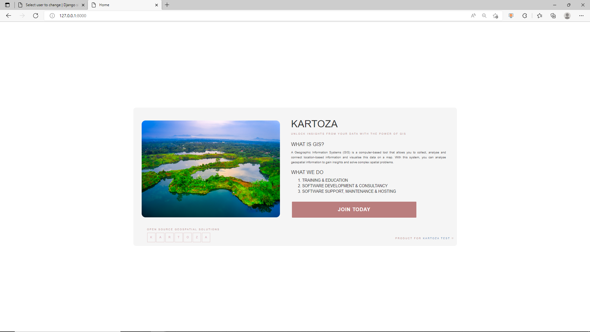
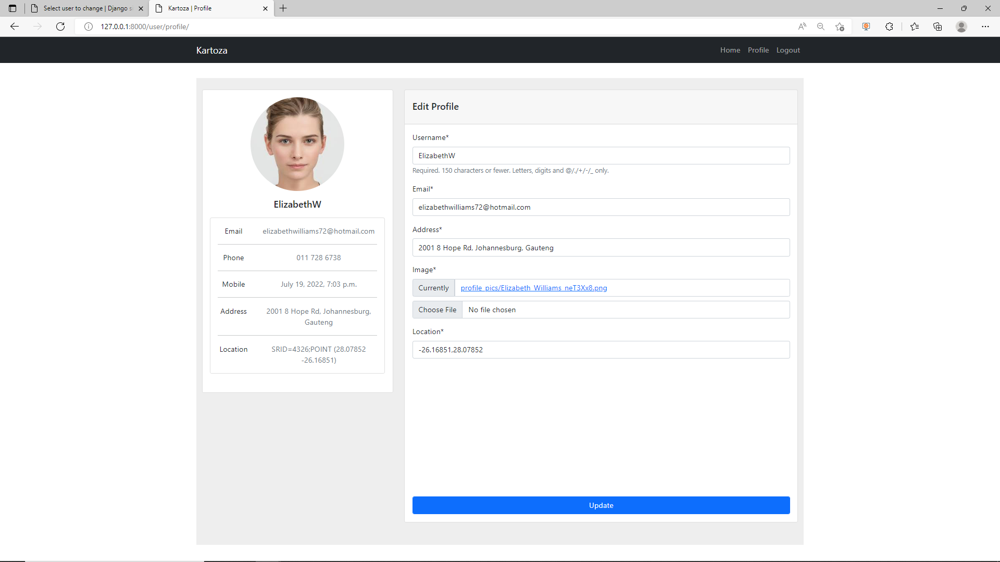

# Kartoza Application
Done by Blessed Mutengwa, blessedmutengwa@gmail.com

## Requirements
To be able to run the Application on a local machine, please run the following command without quotes to install the application dependencies and supporting apps: 
__"python -m pip install -r requirements.txt"__

## Addon Software [Required Software]
To render maps, since they are part of the application, you will need to install:
1. The Geospatial Data Abstraction Library(GDAL) is a computer software library for reading and writing raster and vector geospatial data formats  <h3>Installation</h3>
- Windows  Installation steps are provided on the link https://sandbox.idre.ucla.edu/sandbox/tutorials/installing-gdal-for-windows  Add the following GDAL path in your application settings file e.g. GDAL_LIBRARY_PATH = r"C:\Program Files\GDAL\gdal305.dll"
  
- Linux
 Run the following command in your _terminal_ without quotes: "sudo apt install libpq-dev gdal-bin libgdal-dev"  Add the following paths configurations to your application settings file e.g. GDAL_LIBRARY_PATH = os.getenv('GDAL_LIBRARY_PATH') 
 &nbsp;&nbsp;&nbsp;&nbsp;&nbsp;&nbsp;&nbsp;GEOS_LIBRARY_PATH = os.getenv('GEOS_LIBRARY_PATH')  
- Mac  
Installation steps are provided on the link https://sandbox.idre.ucla.edu/sandbox/general/how-to-install-and-run-gdal   Update the settings application file as illustrated above on the Linux section
## Database
You will need to have installed PostgreSQL and PgAdmin application to view database instances using a GUI.  Amongst other database applications which include __data warehousing, data store, web applications, mobile, analytics applications__ it is also preferred to handle Geospatial data, which is why it was selected as a database for this application.

## Run Application
To run the application, you will need to locate the root directory for the project and: 
1. Migrate the database - type in the terminal the following command without quotes -> python manage.py migrate
2. Run the application server - type in the terminal the following command without quotes -> python manage.py runserver
3. To check if there are any warnings or errors - type in the terminal the following command without quotes -> python manage.py check

## Online Link
To access the deployed online application, you can visit the link https://pydev99.pythonanywhere.com/

## Application Screenshots  
### Database [User Table]

### Database [Extended User to Profile's Table]

### Application [Index Page]

### Application [Login Page]

### Application [Signup Page]

### Application [Home Page for a user who is also a superuser]
#### _Application Routes has Url for logged-in user current profile and Url for All users since the logged-in user is a super-user_

### Application [All Users Page -> Available only to a Super User]

### Application [User Profile - Where a user can edit their profile]

### Application [Home Page for a general user]
#### _Application Routes has Urls for All users since the logged-in user is a super-user_

### Application [General User Profile Edit Page]
